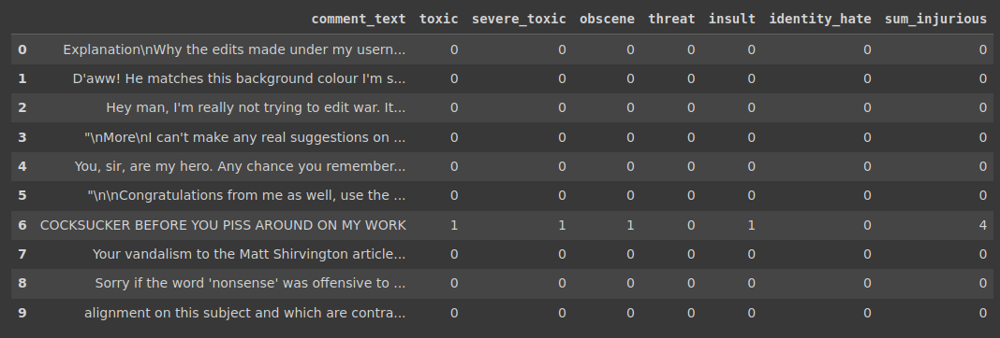
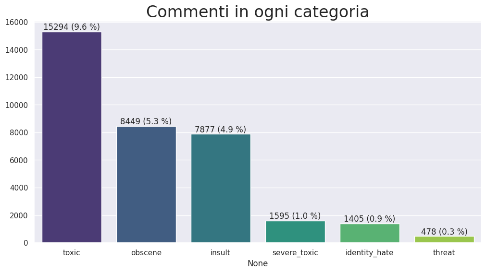

# filtro-commenti-tossici
Usando `tensorflow`, costruire un modello in grado di filtrare i commenti degli utenti in base al grado di dannosità del linguaggio

## Descrizione
Viene fornito un dataset di commenti classificati in base a sei distinte categorie di tossicità:

Svolgimento:
* Analisi esplorativa
* Preprocessing testo
* Modello naive
* Rete neurale ricorrente con strato LSTM bidirezionale
* Affrontare overfitting con dropout e regolarizzazione L2

